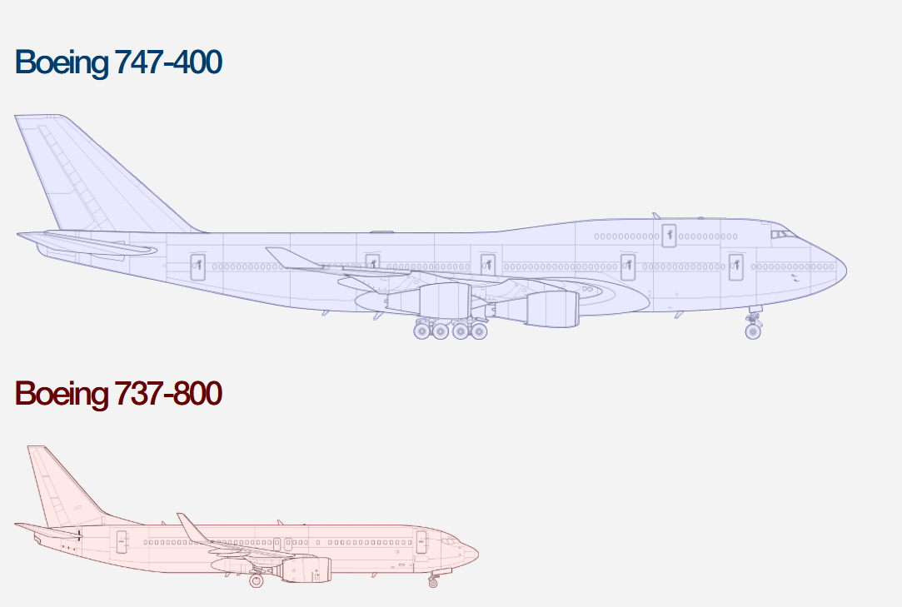

# ✈️ Aircraft Comparator

**Aircraft Comparator lets you compare the physical designs and dimensions of common aircraft, side-by-side.**  
This provides a unique way for aviation enthusiasts, photographers, students, or anyone curious to visualize the true scale of planes.

Note: All aircraft images were obtained at https://www.norebbo.com/

## 🚀 **How to Use**
1. Select two distinct airplanes to compare.
2. View the comparison, including an overlay and optional dimension information.

##  **🛫 Supported Aircraft** 

- Aerospatiale Concorde 
- Airbus A380
- Boeing 737-800 
- Boeing 747-400 
- Boeing 757-200 
- Beechcraft Model 200 
- Bombardier CRJ-700 
- Bombardier CRJ-1000
- Bombardier Global 5000
- Bombardier Global 7500
- Cessna 208 Caravan
- Embraer 175
- Learjet 60
- McDonnell Douglas MD-80

## **🔭 Future Plans**

- Airbus A320
- Boeing 707
- Boeing 747-8
- Boeing 767-300
- Boeing 777-300ER
- Boeing 787-8 Dreamliner
- McDonnell Douglas DC-10
- McDonnell Douglas MD-11

## 👨‍💻 Author
blargenfaarg - https://github.com/blargenfaarg

